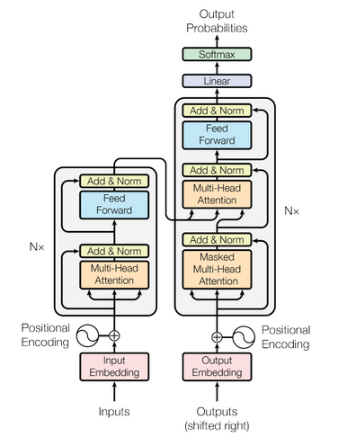

 ## Transformers 
 We seen after "Attention Is All You Need" is introduced Transformers
 became state of the art in NLP.They are used in many applications 
 like Machine language translation, Text Summarization, NER, Chatbot and last but not least to extremely
 empower the search engine with semantic capabilities.As transformer can able to 
 outperform RNN, GRU and LSTM? also may heard of GPT, BERT different famous transformer models.
   
 
 ## Architecture 
 Lets start with architecture and different components used to build extremely powerful
 mechanism.
 
 
 
 We can see different architecture components are stated below we will go in detail.
 1) Input Embedding
  It is a lookup table to grab a learned vector representations of each word. 
  
 2) Positional Encoding:
 It is position wise encoding of input to add information about position in input embedding.
 
 3) Encoder Layer:
 The encoding component is a stack of encoders
 
 4) Decoder Layer:
 The decoding component is a stack of decoders of the same number.

 
 Highlevel working in detail [here](https://ai.googleblog.com/2017/08/transformer-novel-neural-network.html)
 
 
 Alot of Questions arises when we try to understand Transformers will dive details
 
 
 ## what is use of encoder decoder attention?
 It helps the decoder focus on appropriate places in the input sequence
 
 ## What is input to decoder attention?
 it creates its Queries matrix from the layer below it, and takes the Keys and Values matrix from the output of the encoder stack.
 
 
 ## Feature based Attention: Key,Value and Query 
 
 Key-value-query concepts come from information retrieval systems. I found it extremely helpful to clarify these concepts first.
 When you search (query) for a particular video, the search engine will map your query against a set of keys (video title, description, etc.) associated with possible stored videos. Then the algorithm will present you the best-matched videos (values). This is the foundation of content/feature-based lookup.
 
 
 
 
 
## Types of Attention

### Soft/Global Attention
The mechanism we defined earlier is named as Soft/Global Attention. Here we are considering all the encoder states to create the weighted average of the encoder outputs.
### Hard Attention
Same as Soft Attention, the only difference is it chooses only one of the encoder states rather than the weighted average.
This is not differentiable hence used only for specific use cases.
### Local Attention
This is a combination of Soft and Had Attention.
One of the way to implement Local Attention is to use a small window of the encoder hidden states to calculate the context. This is end to End differentiable and called as Predictive Alignment.
### Self-Attention
Use the attention on the same sentence for feature extraction. We can build network just using Self-Attention (Multi-Head Self-Attention) and without even using any RNNs.
We will discuss more on Self-Attention, Multi-Head Self-Attention, and Scaled Dot Product Attention in a future tutorial.
### Hierarchical Attention
Proposed in 2016, Hierarchical Attention is a multi-level neural network architecture that takes advantage of  hierarchical  features in text data.
This is mostly used for Document Classifications.


### Implementations

Most competitive neural sequence transduction models have an encoder-decoder structure (cite). Here, the encoder maps an
nput sequence of symbol representations 
(
x
1
,
…
,
x
n
)
 to a sequence of continuous representations 
z
=
(
z
1
,
…
,
z
n
)
.
Given 
z
, the decoder then generates an output sequence 
(
y
1
,
…
,
y
m
)
 of symbols one element at a time. At each step the model is auto-regressive (cite), consuming the previously generated symbols as additional input when generating the next.
 

```
class EncoderDecoder(nn.Module):
    """
    A standard Encoder-Decoder architecture. Base for this and many 
    other models.
    """
    def __init__(self, encoder, decoder, src_embed, tgt_embed, generator):
        super(EncoderDecoder, self).__init__()
        self.encoder = encoder
        self.decoder = decoder
        self.src_embed = src_embed
        self.tgt_embed = tgt_embed
        self.generator = generator
        
    def forward(self, src, tgt, src_mask, tgt_mask):
        "Take in and process masked src and target sequences."
        return self.decode(self.encode(src, src_mask), src_mask,
                            tgt, tgt_mask)
    
    def encode(self, src, src_mask):
        return self.encoder(self.src_embed(src), src_mask)
    
    def decode(self, memory, src_mask, tgt, tgt_mask):
        return self.decoder(self.tgt_embed(tgt), memory, src_mask, tgt_mask)

```

```
class Generator(nn.Module):

    "Define standard linear + softmax generation step."
    def __init__(self, d_model, vocab):
        super(Generator, self).__init__()
        self.proj = nn.Linear(d_model, vocab)

    def forward(self, x):
        return F.log_softmax(self.proj(x), dim=-1)
```

Here I have just given overview and short code snippets to go through here
http://nlp.seas.harvard.edu/2018/04/03/attention.html

